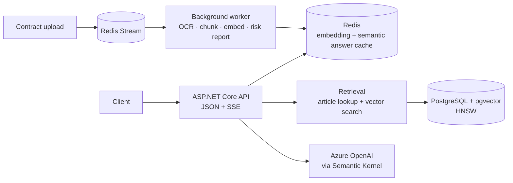

# Hukuk.AI


**Turkish legal question answering with article citations, built on RAG and measured at every step.**

Hukuk.AI answers questions about the Turkish Labour Law (4857) and the Turkish Code of Obligations (6098), and cites the articles each answer rests on. It also reads an uploaded contract, reports its risky clauses with the law article behind each one, and answers questions about the document. It drafts rental and employment contracts from a free-text request and checks its own draft against the law.

> A portfolio project. Its answers are not legal advice.

## Highlights

- **Every design choice is measured.** A dedicated evaluation project compares chunking strategies, search methods, token budgets and prompts on a hand-built question set, so decisions come from numbers.
- **Fast first token.** SSE streaming, a two-level embedding cache and request coalescing cut time to first token from 5–7 s to about 1.8 s.
- **A semantic cache that is safe for law.** Two questions about neighbouring articles can score .946 similar, so cache candidates must also pass a number guard and an LLM verifier before an answer is reused.
- **Direct article lookup.** References such as "TBK 344" or "İş K. m. 17" are parsed and fetched by metadata first; vector search fills the rest.
- **Contract analysis.** Uploads (PDF, DOCX, image) are queued on a Redis Stream, read with Azure Document Intelligence, and kept in Redis for two hours only. A risk is reported only when it has a valid article citation.
- **Drafts that check themselves.** A contract draft is written from a fixed clause skeleton, each section grounded in a fixed list of law articles. The draft streams to the user, then runs through the same risk report as uploaded contracts; clauses that contradict the law are rewritten and reported.
- **Declines out-of-scope questions** instead of summarising unrelated articles.

## Results

Single runs on the project's own evaluation sets.

| Measure | Result |
|---|---|
| Retrieval, vector search at a 2000-token budget | Recall .940, MRR .851 |
| Retrieval, BM25 at the same budget | Recall .687, MRR .571 |
| Live pipeline at a 4000-token budget | Recall .993, answer score .918 (LLM judge) |
| Time to first token | 5–7 s → about 1.8 s |
| Semantic answer cache | 78% of paraphrases served from cache, 0 trap questions leaked |
| Contract risk report | 11 of 11 planted risks found and cited, 1 false alarm |
| Contract question answering | .883 – .967 answer score |
| Contract drafting, illegal user demands removed from the final draft | 13 of 13 and 9 of 13 (two runs) |
| Contract drafting, time to first token / full draft with self-check | about 1.7 s / about 60 s |
| Draft intake, required facts extracted exactly | 24 of 24 and 23 of 24, nothing invented |

Hybrid search (vector + BM25) never beat plain vector search on this data, so the live pipeline uses vector search with direct article lookup.

### Known limits

- **Drafting results vary between runs.** The same code removed 13 of 13 planted illegal demands in one run and 9 of 13 in the next; the set is small (one demand is .077) and the judge is the same model.
- **The self-check is slow.** It takes 35–50 s of the roughly 60 s total, and it sometimes applies articles on agricultural leases to a residential lease.
- **Two retrieval misses are not fixable by prompt.** TBK 310 and TBK 340 stay outside the 4000-token context for two document questions; a reranker is the planned fix.
- **Uploads longer than two pages are untested** (free OCR tier).

## Architecture



| Project | Role |
|---|---|
| `Hukuk.AI` | Web API: questions, document upload, drafting, SSE streaming, background worker |
| `Hukuk.AI.Retrieval` | Query routing, vector search, answer generation, semantic cache |
| `Hukuk.AI.Documents` | Contract reading, chunking, risk report, document Q&A |
| `Hukuk.AI.Drafting` | Draft intake, clause skeletons, draft writing, self-check and fix |
| `Hukuk.AI.Ingestion` | Law text parser, four chunking strategies, embedding |
| `Hukuk.AI.Data` | EF Core model and migrations for pgvector |
| `Hukuk.AI.Evaluation` | Retrieval, answer, cache, scale, contract and drafting evaluations |

## API

| Method | Route | Does |
|---|---|---|
| `POST` | `/api/questions` | Answer a legal question with article citations |
| `POST` | `/api/questions/stream` | The same answer streamed over SSE |
| `POST` | `/api/documents` | Upload a contract for analysis |
| `GET` | `/api/documents/{id}/report` | Risk report with cited articles |
| `POST` | `/api/documents/{id}/questions` | Ask about the uploaded document (also `/stream`) |
| `GET` | `/api/documents/{id}/events` | Processing status over SSE |
| `POST` | `/api/drafts` | Start a contract draft from free text; returns questions for missing facts |
| `POST` | `/api/drafts/{id}/answers` | Answer those questions |
| `POST` | `/api/drafts/{id}/stream` | Write the draft over SSE: text, legal check, revisions |

## Run locally

Requires the .NET 9 SDK, Docker, and an Azure OpenAI resource with a chat and an embedding deployment.

```bash
cd Hukuk.AI
cp .env.example .env            # set POSTGRES_PASSWORD and REDIS_PASSWORD
docker compose up -d            # PostgreSQL + pgvector on 5433, Redis on 6380
```

Keys and connection strings live in .NET user secrets, never in the repository. Set `ConnectionStrings:DefaultConnection`, `ConnectionStrings:Redis`, `AI:AzureOpenAIEndpoint`, `AI:AzureOpenAIKey`, `AI:ChatDeploymentName` and `AI:EmbeddingDeploymentName`.

```bash
dotnet ef database update --project Hukuk.AI.Data
dotnet run --project Hukuk.AI.Ingestion -- embed   # parse, chunk and embed the law texts
dotnet run --project Hukuk.AI                      # http://localhost:5073
```
